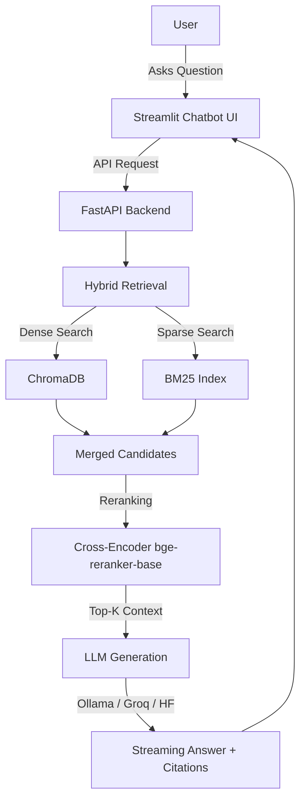

# Loan Eligibility Assistant

A local AI-powered banking loan eligibility assistant built with FastAPI, Streamlit, ChromaDB, LangChain, Ollama, Docker, and Langfuse.

The application answers questions about loan eligibility rules using Retrieval-Augmented Generation (RAG) over local policy PDFs. It keeps source citations with answers, supports a chatbot-style Streamlit interface, and can run locally or with both frontend and backend in Docker. The LLM model stays outside Docker and is served by Ollama on the host machine.

## Business Problem

Loan pre-qualification takes staff time and can produce inconsistent answers. This assistant provides a consistent, document-grounded way to answer common loan eligibility questions about income, credit score, age, documents, debt-to-income ratio, tenure, and applicant type.

## Current Features

- **FastAPI backend** with `/ask`, `/ask/stream`, `/health`, and `/` endpoints
- **Streamlit chatbot frontend** with streaming answers and session conversation history
- **Advanced Hybrid RAG**:
  - **Sentence-aware Chunking**: Uses NLTK `sent_tokenize` to ensure legal clauses are not cut mid-sentence, carrying over overlapping sentences for context.
  - **Hybrid Retrieval**: Combines Dense Retrieval (ChromaDB) and Sparse Retrieval (Custom BM25 algorithm) for maximum coverage.
  - **Neural Reranking**: Uses `CrossEncoder('BAAI/bge-reranker-base')` to rerank and select the top 5 most semantically relevant chunks.
- **Local Execution**: Uses Ollama for local chat models and embeddings.
- **Source Citations**: Answers include exact excerpts, page numbers, and clause identifiers.
- **Optional Fallback Generation**: Support for Groq or Hugging Face.
- **Observability & Logging**: Langfuse tracing wrapper and local audit logs in JSONL format.
- **Docker Support**: Containerized FastAPI backend and Streamlit frontend.

## Architecture Flow



## Tech Stack

| Layer | Tool | Purpose |
|---|---|---|
| Frontend | Streamlit | Local chatbot UI |
| Backend | FastAPI | API layer for chat requests |
| RAG Framework | LangChain | PDF loading, chunking, retrieval, and LLM calls |
| Chunking | NLTK | Sentence-aware tokenization to preserve legal clauses |
| Vector Store | ChromaDB | Local semantic search (Dense retrieval) |
| Sparse Search | BM25 | Custom keyword-based exact match retrieval |
| Reranking | Sentence-Transformers | Cross-Encoder for semantic query-document scoring |
| LLM Runtime | Ollama | Local open-source model execution |
| Embeddings | Ollama embeddings | Local vector embeddings for retrieval |
| Tracing | Langfuse | Observability around API/RAG calls |
| Audit Logs | JSONL file | Local request metadata logging |
| Containerization | Docker | Portable backend & frontend runtime |

## Project Structure

- `app/`: FastAPI application code
  - `main.py`: API routing and application entrypoint
  - `rag.py`: Core RAG logic (Chunking, BM25, Reranker, LLM calls)
  - `config.py`: Environment configurations
  - `tracing.py`, `audit.py`, `guardrails_config.py`: Observability and safety checks
- `data/`: Source PDFs for vectorstore ingestion (e.g. `MBBL_Business_Loan_Agreement_New.pdf`, `Businees-Loan-for-Entitiy(Unsecured)-Agreement.pdf`)
- `frontend/`: Streamlit UI (`streamlit_app.py`)
- `scripts/`: Utility scripts (e.g., `create_synthetic_pdf.py`)
- `vectorstore/`: Local persistent storage for ChromaDB and document caches
- `logs/`: Application audit logs (`audit.jsonl`)
- Config files: `Dockerfile`, `Dockerfile.frontend`, `docker-compose.yml`, `requirements.txt`, etc.

## Prerequisites

- Python 3.11
- Git
- Ollama
- Docker Desktop (optional, for containerized run)

## Ollama Setup

1. Start Ollama: `ollama serve`
2. Pull chat model: `ollama pull qwen3.5:2b`
3. Pull embedding model: `ollama pull nomic-embed-text`
4. Test: `ollama run qwen3.5:2b "Reply only: ready"`

## Environment Variables

Create a `.env` file in the project root:

```env
CHAT_MODEL=qwen3.5:2b
EMBEDDING_MODEL=nomic-embed-text:latest
OLLAMA_BASE_URL=http://localhost:11434
OLLAMA_WARMUP_TIMEOUT=20

FALLBACK_MODEL_PROVIDER=none
GROQ_API_KEY=
GROQ_MODEL=openai/gpt-oss-20b
HF_API_KEY=
HF_MODEL=mistralai/Mistral-7B-Instruct-v0.3
```

## Run Locally

1. Create and activate a virtual environment:
   ```powershell
   python -m venv capstone
   .\capstone\Scripts\activate
   ```
2. Install dependencies:
   ```powershell
   pip install -r requirements.txt
   ```
3. Start backend:
   ```powershell
   uvicorn app.main:app --reload
   ```
4. Start frontend:
   ```powershell
   streamlit run frontend/streamlit_app.py
   ```

## Run With Docker Compose

```powershell
# Start Ollama on the host machine first
ollama serve

# Build and start the app
docker compose up --build
```

> [!NOTE]
> The application downloads the `BAAI/bge-reranker-base` model (~270MB) and NLTK data on first startup. To avoid re-downloading these every time the container restarts, ensure your `docker-compose.yml` mounts the HuggingFace and NLTK cache directories from your host machine (e.g., `~/.cache/huggingface:/root/.cache/huggingface`).

## Model Switching & API Fallback

Update `CHAT_MODEL` in `.env` to switch Ollama models. To use a hosted API fallback like Groq or Hugging Face, change `FALLBACK_MODEL_PROVIDER` and provide the respective `API_KEY`.

## Troubleshooting

- **Vector store issues**: If the vector store behaves strangely, stop the backend, delete the local `vectorstore/` folder, and restart the backend so it rebuilds from the PDF.
- **Ollama connectivity**: If using Docker, ensure `OLLAMA_BASE_URL=http://host.docker.internal:11434` is set.
